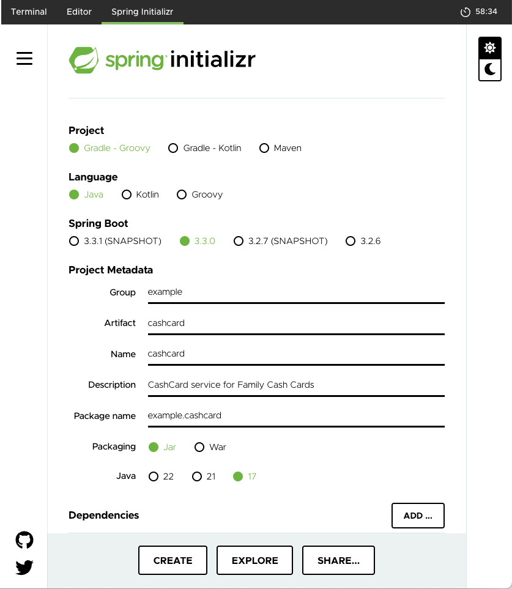
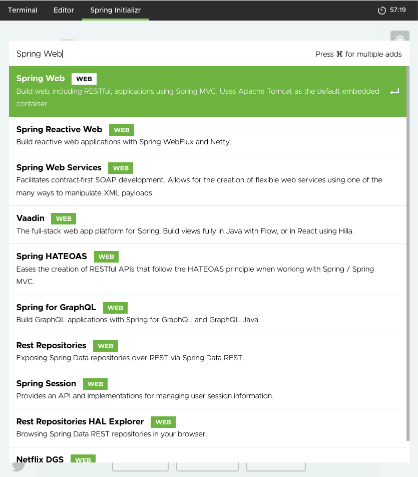

Complete the following steps to use Spring Initializr to set up the Family Cash Card REST API application.

1. Open dashboard tab labeled _Spring Initializr_:

   

   **Note:** You may notice that the Initializr dashboard has different versions than what we show you here.
   The Spring Team continually updates the Initializr with the latest available versions of Spring
   and Spring Boot.

1. Select the following options:

   - Project: **Gradle - Groovy**
   - Language: **Java**
   - SpringBoot: Choose the latest **3.3.X** version

1. Enter the following values next to the corresponding Project Metadata fields:

   - Group: `example`
   - Artifact: `cashcard`
   - Name: `CashCard`
   - Description: `CashCard service for Family Cash Cards`
   - Packaging: **Jar**
   - Java: **17**

   **Note:** You don't have to enter the "Package name" field -- Spring Initializr will fill this in for you!

1. Select the **ADD DEPENDENCIES...** button from the **Dependencies** panel.

1. Select the following option, since we know that we'll be creating a web application:

   - Web options: **Spring Web**

   Later on in the course, you'll be adding additional dependencies without using Spring Initializr.

   

1. Click the **CREATE** button. Spring Initializr generates a zip file of code and unzips it in your home directory.

1. From the command line in the _Terminal_ tab, enter the following commands to use the gradle wrapper to build and test the generated application.

   Go to the `cashcard` directory in the _Terminal_ dashboard tab.

   ```dashboard:open-dashboard
   name: Terminal
   ```

   ```shell
   [~] $ cd cashcard
   [~/cashcard] $
   ```

   Next, run the `./gradlew build` command:

   ```shell
   [~/cashcard] $ ./gradlew build
   ```

   The output shows that the application passed the tests and was successfully built.

   ```
   [~/cashcard] $ ./gradlew build
   Downloading https://services.gradle.org/distributions/gradle-bin.zip
   ............10%............20%............30%.............40%............50%............60%............70%.............80%............90%............100%

   Welcome to Gradle!
   ...
   Starting a Gradle Daemon (subsequent builds will be faster)

   > Task :test
   ...
   BUILD SUCCESSFUL in 39s
   7 actionable tasks: 7 executed
   ```

## Summary

Congratulations! You’ve just learned how to quickly and easily bootstrap a Spring Boot codebase using Spring Initializr.
