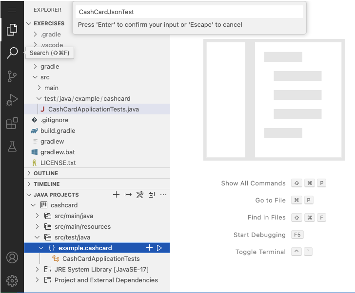

Here we’ll cover a brief introduction to the JUnit test library and the Gradle build tool. We’ll also use the Test-First
approach to building software.

Test classes in a standard Java project are in the `src/`<b>`test`</b> directory, _not_ `src/`<b>`main`</b>. In our case we've decided to put our code in the `example.cashcard` package,
so our test files should be in the `src/`<b>`test`</b>`/java/`<b>`example/cashcard`</b> directory.

1. Create the test class `CashCardJsonTest`.

   The first thing we need to do is create our new test class in the `src/test/java/example/cashcard` directory.

   You can do this by clicking the "click-action" below or by using the Editor to the right as follows:

   ```editor:append-lines-to-file
   file: ~/exercises/src/test/java/example/cashcard/CashCardJsonTest.java
   description: "Create CashCardJsonTest.java"
   ```

   1. Open the **JAVA PROJECTS** section at the bottom left of the page.
   1. Open the `src/test/java` directory.
   1. Within `src/test/java`, select the `example.cashcard` package and click on the **+** sign to the right.
   1. A dialog will appear asking for the new class name. Enter `CashCardJsonTest.java`.

   Here is a screenshot depicting the above steps: .

1. Edit the resulting new file so that it contains the following content:

   ```java
   package example.cashcard;

   import org.junit.jupiter.api.Test;
   import static org.assertj.core.api.Assertions.assertThat;

   class CashCardJsonTest {

      @Test
      void myFirstTest() {
         assertThat(1).isEqualTo(42);
      }
   }
   ```

   Take a moment to understand the test code: The `@Test` annotation is part of the JUnit library, and the `assertThat` method is part of the AssertJ library.
   Both of these libraries are imported after the `package` statement.

   A common convention (but not a requirement) is to always use the `Test` suffix for test classes. We’ve
   done that here. The full class name `CashCardJsonTest` gives you a clue about the nature of the test we're about to write.

   In true Test-First fashion, we've written a failing test first. It's important to have a failing test first so you
   can have high confidence that whatever you did to _fix_ the test actually worked.

   Don't worry that the test (asserting that 1 is equal to 42), as well as the test method name, seem strange. We're
   about to change them.

1. Run the test from the command line in your terminal (make sure you are in the `exercises` directory first):

   ```dashboard:open-dashboard
   name: Terminal
   ```

   ```shell
   [~/exercises] $ ./gradlew test
   ```

   You should receive output like this (we've omitted some of the less important output):

   ```shell
   > Task :test

   CashCardApplicationTests > contextLoads() PASSED

   CashCardJsonTest > myFirstTest() FAILED
       org.opentest4j.AssertionFailedError:
       expected: 42
        but was: 1
   ...
           at app//example.cashcard.CashCardJsonTest.myFirstTest(CashCardJsonTest.java:11)

   2 tests completed, 1 failed
   ```

   This is the expected output from the Gradle build tool when you have a failing test. In this case, your new test
   failed, whereas the existing `CashCardsApplicationTest` from the previous lesson succeeded.

   The pertinent failure information is towards the top of the output:

   ```shell
   expected: 42
    but was: 1
   ```

   You might have expected this, as the number 1 is not equal to the number 42.

1. In order to "fix" the test, you can assert a statement that you know is true:

   ```editor:select-matching-text
   file: ~/exercises/src/test/java/example/cashcard/CashCardJsonTest.java
   text: "void myFirstTest"
   description:
   ```

   ```
   assertThat(42).isEqualTo(42);
   ```

1. Now run the test again. It passes!

   ```dashboard:open-dashboard
   name: Terminal
   ```

   ```shell
   [~/exercises] $ ./gradlew test

   > Task :test

   CashCardJsonTest > myFirstTest() PASSED

   CashCardApplicationTests > contextLoads() PASSED

   BUILD SUCCESSFUL in 4s
   ```

Congratulations! You’ve successfully completed an iteration of test-first development: Write a failing test, then correct the
code so that the test passes. You’re now ready to proceed with using Test-First methodology to write the Cash Card REST
API.
